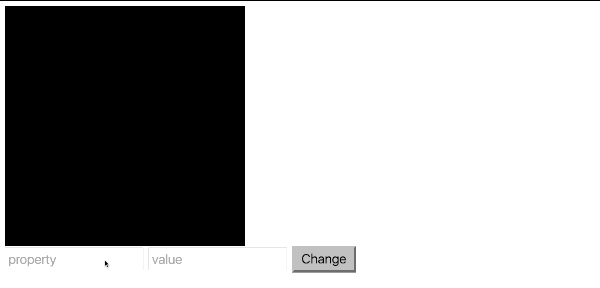

## DOM и не только.

### Release 0
- Добавь на страницу html контейнер с классом "box".
- Добавь поле ввода с id="very-important-message" вместе с кнопкой. Когда пользователь нажимает кнопку, внутри элемента с классом "box" должен появиться текст из поля ввода.
- Добавь еще 2 поля ввода: одно - для CSS-свойства, второе - для его значения. Когда пользователь нажимает на кнопку, элемент с классом "box" должен не только отображать введенный текст, но и применить введенные стили. Пример изменения стилей есть на гифке ниже.
- В итоге на странице должны получится три поля ввода, одна кнопка, один элемент, которые отображает текст и меняет стили.

**ВАЖНО**, чтобы можно было использовать любые стили. Работа будет возвращена, если будет работать только с 3 стилями, как на анимации ниже. 

